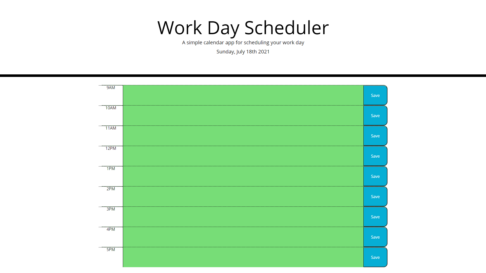

# Work Day Scheduler Starter Code
This is a work day scheduler, which:
- lists time-blocks from 9-5 that are editable 
- allows the user to save their inputed tasks 
- displays the time-block hours by color corresponding to the time left to complete said task
(past hours are in white, present hours are in red, and future hours are in green).

Link to deployed application: https://walidhkhan.github.io/password-generator/